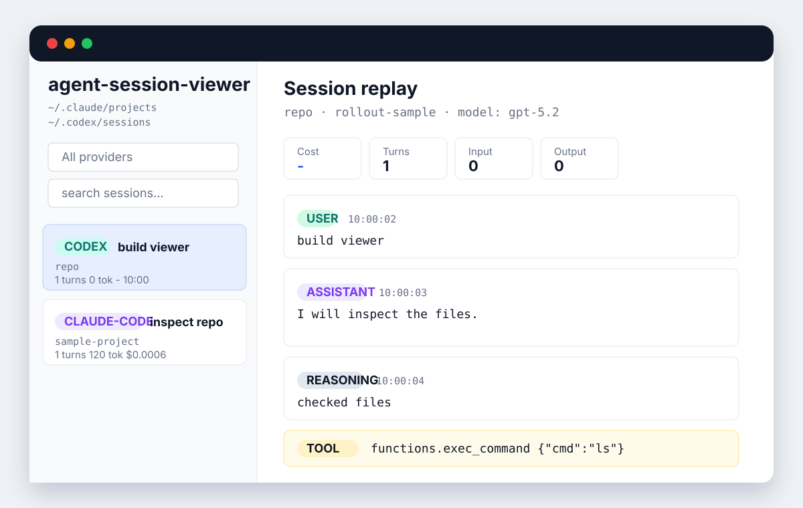
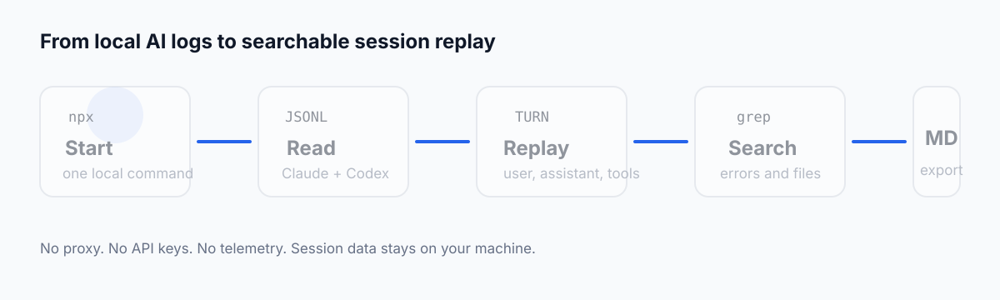

# agent-session-viewer

Local session replay and recap viewer for Claude Code and Codex.

[](LICENSE)


`ccusage` tells you how much you spent. `agent-session-viewer` shows what actually happened and helps you pick up where you left off.

It reads your local JSONL logs directly, then lets you inspect user prompts, assistant replies, reasoning summaries, tool calls, tool results, events, and attachments in one local Web UI. The `recap` command generates a local Markdown work summary from recent Claude Code and Codex sessions without calling an external LLM.



See the [demo walkthrough](docs/demo.md) for screenshots using sanitized Claude Code and Codex fixtures.

## Why

AI coding assistants leave useful local traces, but raw JSONL files are hard to read when you need to answer practical questions:

- What did I ask Claude Code or Codex yesterday?
- Which tool call changed this file?
- What command output led the agent to that answer?
- Where did this error first appear across old sessions?
- What did I work on before the weekend, and where should I restart?
- What should I export into a bug report, PR, or postmortem?

This project focuses on local session replay, turn inspection, recap, and search. Cost and token numbers are useful context, but they are not the primary product.

## Install

The npm package is scoped because the unscoped `agent-session-viewer` package name is already occupied by another project.

```bash
npm install -g @coratch/agent-session-viewer
agent-session-viewer
```

Try without installing globally:

```bash
npx @coratch/agent-session-viewer@latest
```

Try the packaged Web UI demo without local logs:

```bash
npx @coratch/agent-session-viewer@latest --demo
```

Try the packaged recap demo:

```bash
npx @coratch/agent-session-viewer@latest recap --demo
```

Install from GitHub when testing unreleased changes:

```bash
npm install -g github:Coratch/agent-session-viewer
```

## What It Reads

```text
~/.claude/projects/**/*.jsonl
~/.codex/sessions/**/*.jsonl
```

The server binds to `127.0.0.1:4500` by default. It does not proxy model traffic, require API keys, upload logs, or send telemetry.

## Features

- Browse Claude Code and Codex sessions in one UI
- Inspect turn-level `user`, `assistant`, `reasoning`, `tool_call`, `tool_result`, `event`, and `attachment` records
- See provider, project, title, model, cwd, token, and estimated Claude cost metadata
- Filter sessions by provider and keyword
- Generate a local Markdown recap of recent work with default redaction
- Keep private logs local by default
- Run as a zero-dependency Node.js CLI



## CLI

```bash
agent-session-viewer
agent-session-viewer --port 5000
agent-session-viewer --host 127.0.0.1
agent-session-viewer --provider claude-code,codex
agent-session-viewer --claude-dir ~/.claude/projects
agent-session-viewer --codex-dir ~/.codex/sessions
agent-session-viewer --demo
```

Generate a local work recap:

```bash
agent-session-viewer recap
agent-session-viewer recap --days 7
agent-session-viewer recap --since 2026-05-01
agent-session-viewer recap --project agent-session-viewer
agent-session-viewer recap --provider claude-code,codex
agent-session-viewer recap --out recap.md
agent-session-viewer recap --demo
```

Recap output is generated with local rules, not an external LLM. It includes active projects, completed items, open threads, commands/files, key decisions, and next actions. Basic redaction is enabled by default for home paths and common token/header shapes.

Binding to `0.0.0.0` can expose private prompts, tool output, repository paths, and command output. Use a trusted reverse proxy and authentication before exposing it to a network.

## Comparison

| Tool | Primary focus | Claude Code | Codex | Local session replay | Export focus | Notes |
| --- | --- | --- | --- | --- | --- | --- |
| `agent-session-viewer` | Local JSONL session replay and recap | Yes | Yes | Yes | Recap now, export planned | Lightweight zero-dependency CLI for turn, reasoning, tool call, event, and work recap review |
| `claude-code-log` | Claude Code log reading and export | Yes | No | Yes | Yes | Strong Markdown/HTML export workflow for Claude Code logs |
| `sniffly` | Claude Code observability dashboard | Yes | No | Yes | Partial | Strong local-first privacy positioning and usage analytics |
| `claude-code-viewer` | Claude Code Web/PWA workflows | Yes | No | Yes | Partial | Larger Claude Code-oriented viewer with project and session workflows |
| `cxresume` | Codex resume helper | No | Yes | Partial | No | Focused on finding and resuming Codex sessions |
| `ccusage` | Token and cost reports | Yes | No | No | Reports | Best for cost and token accounting, not conversation replay |

## Roadmap

- Markdown and JSON export
- Global search across all sessions
- In-session search and jump-to-turn
- Configurable redaction levels
- Better structured display for shell commands, MCP calls, and web searches

## Development

```bash
npm test
npm run check
npm run pack:check
npm start
```

The frontend is static HTML/CSS/JS in the first phase. Provider-specific parsing lives under `src/providers/`, and both providers normalize into common `Session` and `Turn` objects before the API returns data to the browser.
