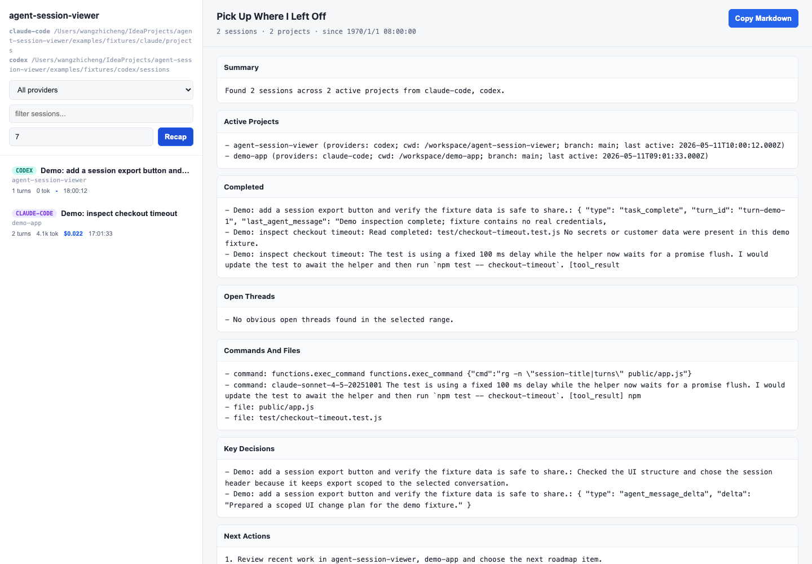
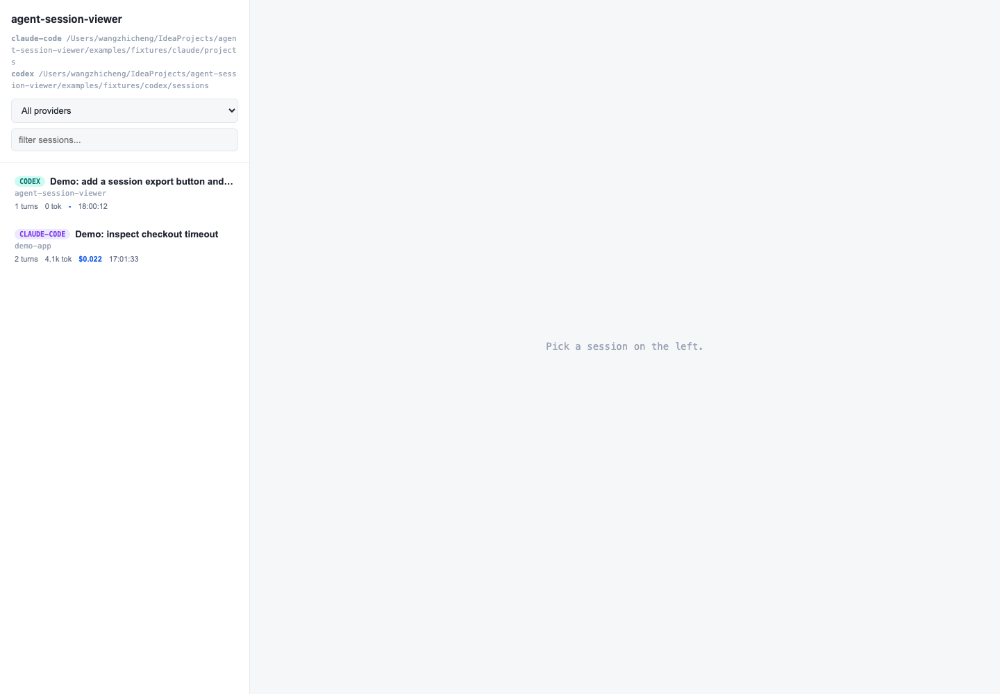
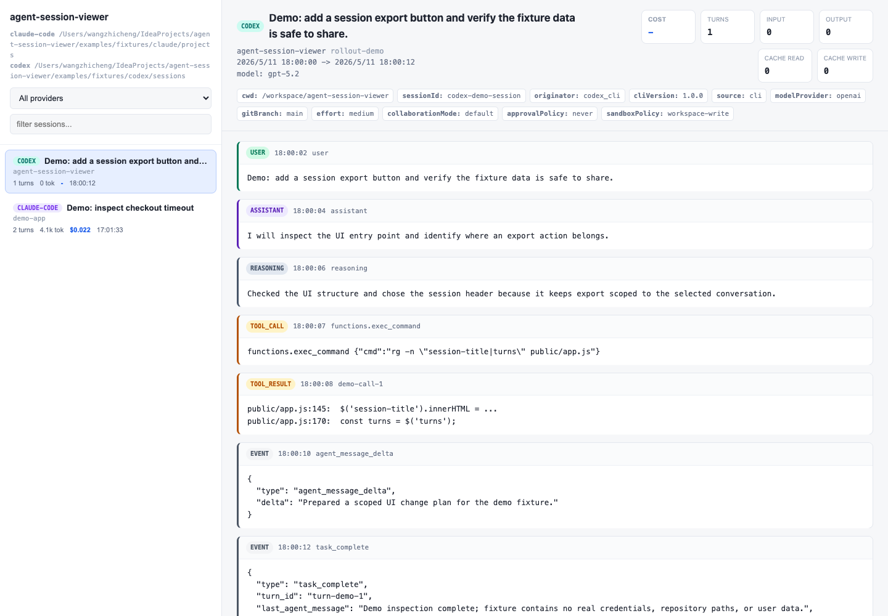

# Demo

Use demo mode when you want to try AgentLens without local Claude Code or Codex logs:

```bash
npx @coratch/agent-session-viewer@latest --demo
```

For a local checkout:

```bash
npm start -- --demo
```

Demo mode reads sanitized fixtures from `examples/fixtures/` and opens the same local Web UI used for real session logs.

Generate a local recap from the same packaged fixtures:

```bash
npx @coratch/agent-session-viewer@latest recap --demo
```

The recap command uses local rules rather than an external LLM, so it can run without API keys or network calls beyond the package install. The Web UI also has an experimental per-session analysis flow that can use your local Claude CLI when you choose to run it.

Export one sanitized demo session as Markdown:

```bash
npx @coratch/agent-session-viewer@latest export --demo --provider codex --id rollout-demo --redaction strict --out session.md
```

The export command is useful when a teammate or issue needs turn-level evidence rather than a high-level recap.

```markdown
# Pick Up Where I Left Off

## Summary
Found 2 sessions across 2 active projects from claude-code, codex.

## Active Projects
- agent-session-viewer
- demo-app

## Completed
- Demo inspection complete
- npm test -- checkout-timeout

## Next Actions
1. Review recent work and choose the next roadmap item.
```

The same recap is available in the Web UI through the top bar `Resume Work` control:



## Session List



The top bar owns provider filtering, search, source refresh, and work recap. The left rail is dedicated to local sessions and shows Claude Code and Codex sessions side by side, including provider, title, project, update time, turn count, and lightweight status chips. The left rail and right inspector can both be collapsed when you need more reading space.

## Turn Detail


Selecting a session expands provider-neutral metadata and normalized turns, so user prompts, assistant messages, reasoning summaries, events, and attachments can be read in one place.

The Analysis panel in the right inspector can run a single-session time diagnosis. During analysis the UI shows the staged process; after completion it renders a primary diagnosis, duration metrics, delay timeline, root causes, confidence, and evidence buttons that jump back to the original turns. Current-session reload lives beside the session title, while source refresh lives in the top bar.

## Tool Calls And Reasoning



The Codex fixture includes reasoning summaries, tool calls, tool results, and task events. Encrypted reasoning payloads are not rendered; only available summaries are shown.
